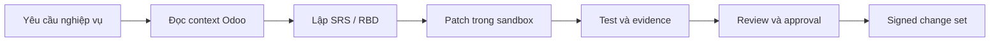

Lio là hệ sinh thái AI Agents do ERPCloud phát triển, giúp doanh nghiệp biến một yêu cầu vận hành thành thay đổi ERP có ngữ cảnh, có kiểm thử, có bằng chứng và được con người phê duyệt trước khi triển khai.

Lio không thay thế người chịu trách nhiệm về nghiệp vụ hay hệ thống. Lio giúp đội ngũ hiểu vấn đề nhanh hơn, chuẩn hóa cách làm và giảm rủi ro khi thay đổi Odoo/ERP.

## Một ví dụ gần với doanh nghiệp

Giả sử doanh nghiệp muốn thay đổi quy trình duyệt đơn hàng: đơn có giá trị lớn phải qua thêm một cấp phê duyệt, nhưng không được làm hỏng quyền hiện tại hoặc quy trình kho.

Thay vì bắt đầu bằng một đoạn code rời rạc, đội ngũ mô tả yêu cầu bằng ngôn ngữ nghiệp vụ. Lio giúp nối yêu cầu đó với module, model, view, quyền, workflow và dependency đang có.

## Từ yêu cầu đến change set

Quy trình gồm sáu bước:

1. **Mô tả yêu cầu** bằng ngôn ngữ doanh nghiệp, mục tiêu và điều kiện nghiệm thu.
2. **Đọc context Odoo** gồm model, view, security, workflow và dependency liên quan.
3. **Lập SRS/RBD** để thống nhất phạm vi, tác động và cách kiểm thử trước khi code.
4. **Tạo patch trong sandbox/worktree riêng**, không chỉnh trực tiếp production.
5. **Chạy test và lưu evidence**: diff, kết quả kiểm thử, log và các điểm cần review.
6. **Review và phê duyệt** trước khi tạo signed change set để promotion.

## Lio không làm gì?

- Không tự sửa thẳng production.
- Không tự vượt qua quyền hạn hoặc approval gate.
- Không coi output của model là bằng chứng kiểm thử.
- Không giữ credential VPS trên trình duyệt.
- Không quyết định thay doanh nghiệp về chính sách, dữ liệu hoặc trách nhiệm vận hành.

## Ai dùng gì?

| Vai trò | Giá trị chính |
| --- | --- |
| Chủ doanh nghiệp | Nhìn thấy yêu cầu đang được chuyển thành thay đổi nào và rủi ro ra sao. |
| Key user | Mô tả quy trình bằng ngôn ngữ nghiệp vụ, xem phạm vi và kết quả kiểm thử. |
| Developer Odoo | Dùng LioDev để đọc context, tạo patch, debug và review code. |
| Đội ERPCloud | Quản lý skills, sandbox, policy, evidence và signed release. |

## Ba lớp trong hệ sinh thái

- **Lio** là hệ sinh thái AI Agents cho vận hành số.
- **LioDev** là công cụ phát triển Odoo/ERP dành cho developer và đội triển khai.
- **ERPCloud** là nền tảng ERP và dịch vụ giúp doanh nghiệp đưa giải pháp vào vận hành.

## Bắt đầu tìm hiểu

- [Khám phá LioDev](https://lio.vn/)
- [Xem mã nguồn trên GitHub](https://github.com/itgisgroup/lio)
- [Trao đổi cùng ERPCloud qua Zalo](https://zalo.me/0909099580)

Đây là cách tiếp cận minh bạch và có kiểm soát: AI hỗ trợ phân tích và tạo đề xuất, còn doanh nghiệp vẫn giữ quyền quyết định cuối cùng.
